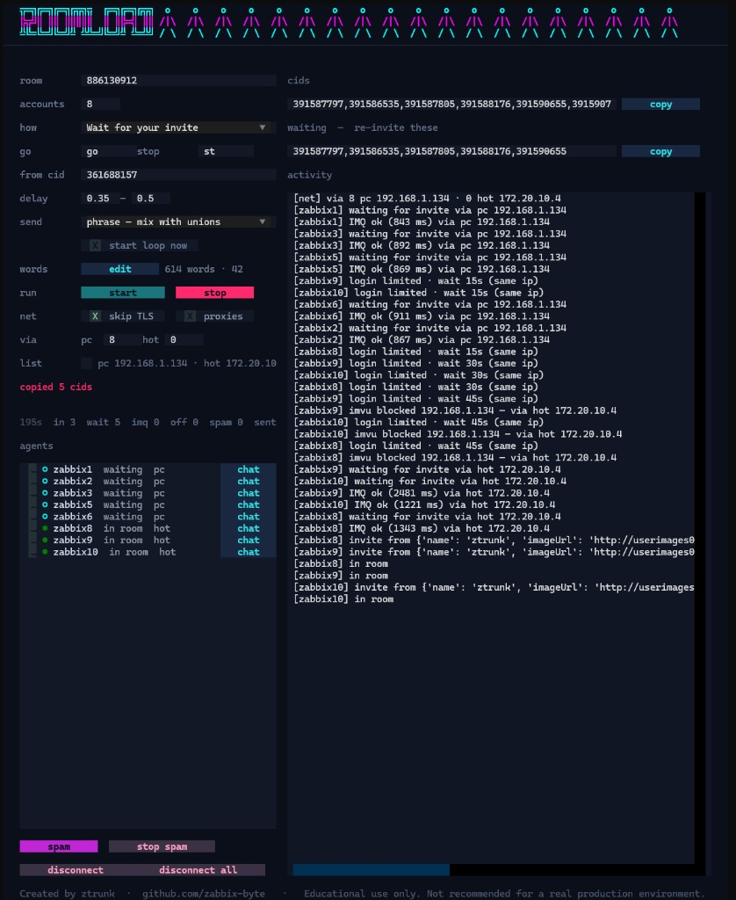

<h1 align="center">ROOMLOAD<p align="center">
</p>
</h1>


<p align="center"><em>IMVU-Bots-Loader · fill the seats, keep the vibe</em></p>

<p align="center">
  <a href="https://github.com/zabbix-byte">ztrunk</a>
  ·
  <a href="https://github.com/zabbix-byte">github.com/zabbix-byte</a>
</p>

<p align="center">
  
</p>

---

You know that moment when a public room feels empty and sad? This is a **terminal toy** that walks test accounts into a chat the same way the desktop client does: login, join, IMQ, sit down, wait for your `go`.

It is a neon lobby in your PowerShell. No kilometric flags. You type the room id, hit **F5**, and watch the dots turn green.


## This is a lab coat, not a ski mask

Created by **[ztrunk](https://github.com/zabbix-byte)** for **educational purposes**.

It exists so you can see how a client talks to a backend you own: XML-RPC login, `getOrMakeChat`, IMQ floodgates, subscribe, chat JSON. It is **not recommended for a real production environment**. If the room is not yours and the accounts are not test accounts you created on purpose, close the terminal and go touch grass.

## Give the experiment a star

If this made you grin, or you stole three ideas for your own client research, **drop a star on the repo**. Stars keep the night-shift experiments alive. No star tax, no newsletter, just a little star so I know someone else is in the room.

**Want in on the chaos?**

- Open an issue and **propose a weird idea** (new mode, nicer TUI pane, safer reconnect, funnier wordlist).
- Or skip the speech and **send a PR**.

The juicy bits to fork are the **handlers** — that is where chat events become actions:

| What you want to change | Start here |
|---|---|
| `go` / `st` trigger, spam loop | `make_trigger_handler` in [`roomload.py`](roomload.py) |
| Invite accept / join-after-ping | `make_invite_handler` |
| IMQ frames, pings, floodgates | `ImqClient` |
| The neon screens | [`tui.py`](tui.py) |

PRs that make handlers cleaner, add a new trigger verb, or stop a bot from ghosting the room are the ones that get a fast merge and a virtual high-five.

## Boot the lobby

```bat
python -m venv .venv
.venv\Scripts\pip install -r requirements.txt
copy accounts.example accounts.txt
.venv\Scripts\python roomload.py
```

Put `user:password` test accounts in `accounts.txt`. The TUI remembers the last room in `.roomload.json`.

| Key | What it does |
|---|---|
| **F5** / START | walk in |
| **S** | stop |
| **Q** | quit |

Modes: **spam** (stay, talk when you say `go`), **listen** (one reply), **churn** (in and out — only if you really want that).

Still like flags? They still work:

```bat
.venv\Scripts\python roomload.py --room 160727756-546 --count 4 --insecure --spam --trigger go
```

## Protocol snack

1. XML-RPC `test.avatarInfoForLogin2`
2. `chat.getOrMakeChat`
3. IMQ: connect, challenge, `C2G_OPEN_FLOODGATES`, subscribe `/chat/<id>`
4. Sit. Listen. Maybe talk.

## License of the night

Made at 2am by [ztrunk](https://github.com/zabbix-byte). Star it, roast it, or PR a better handler. Just keep it in the lab.
